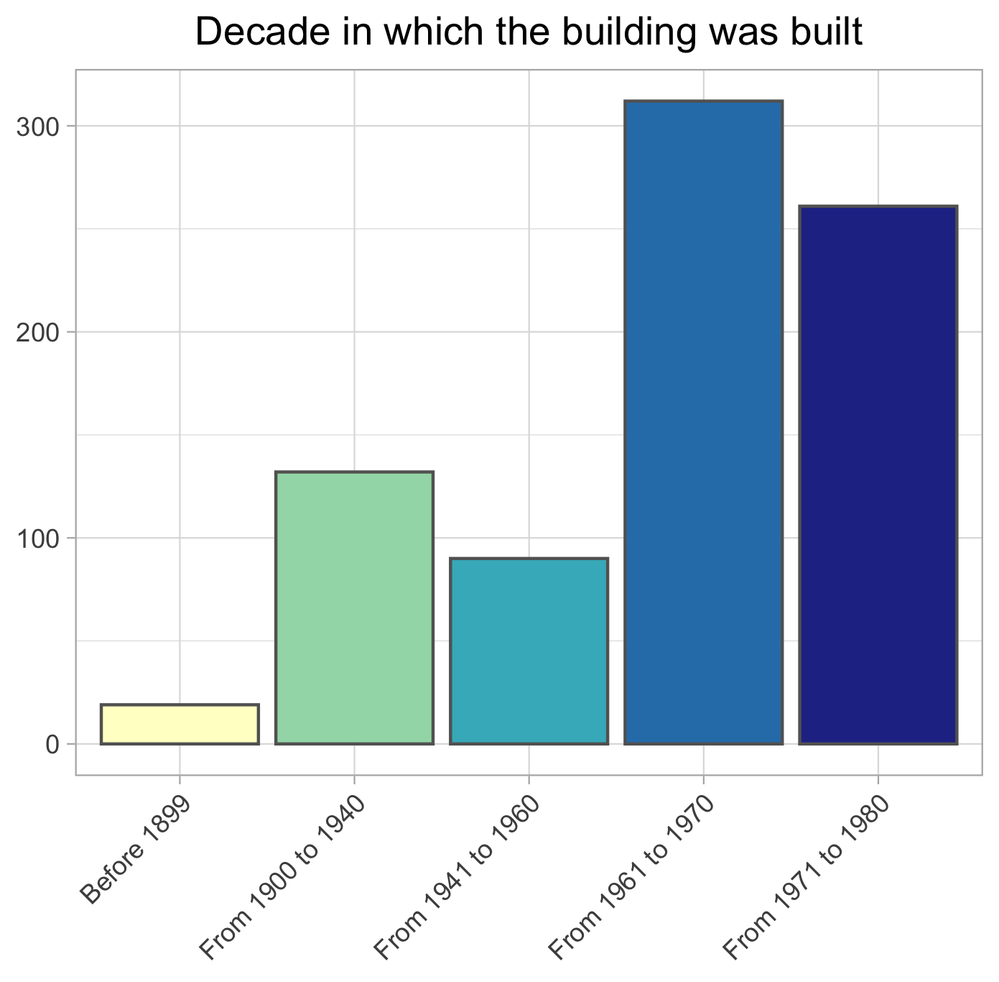
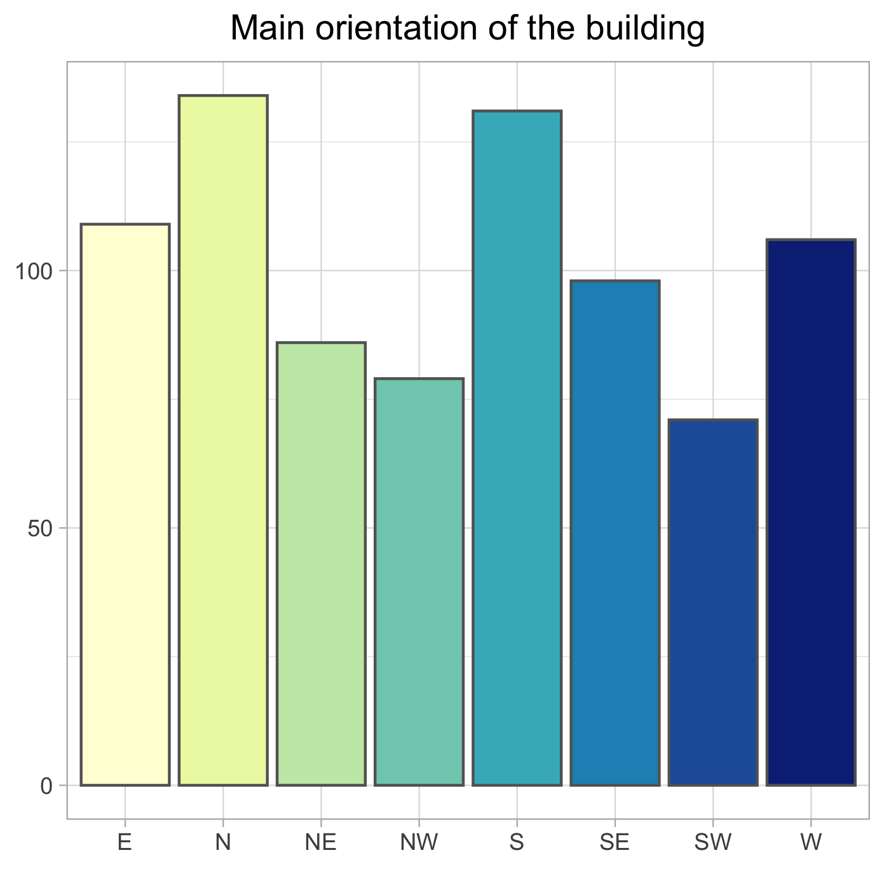
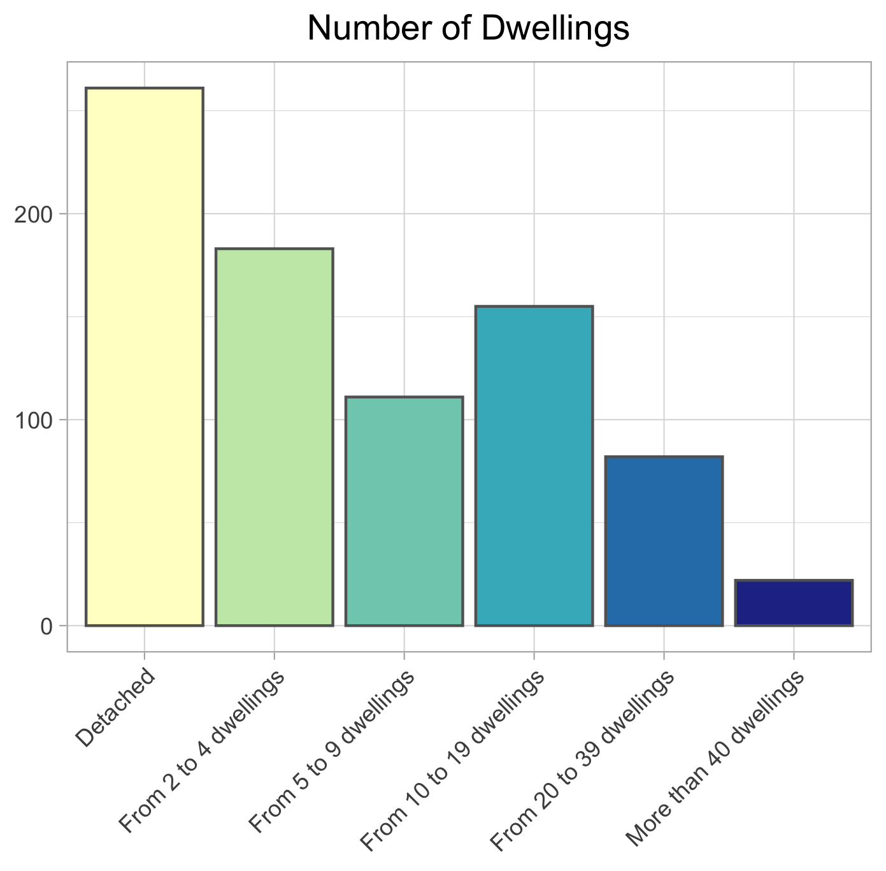
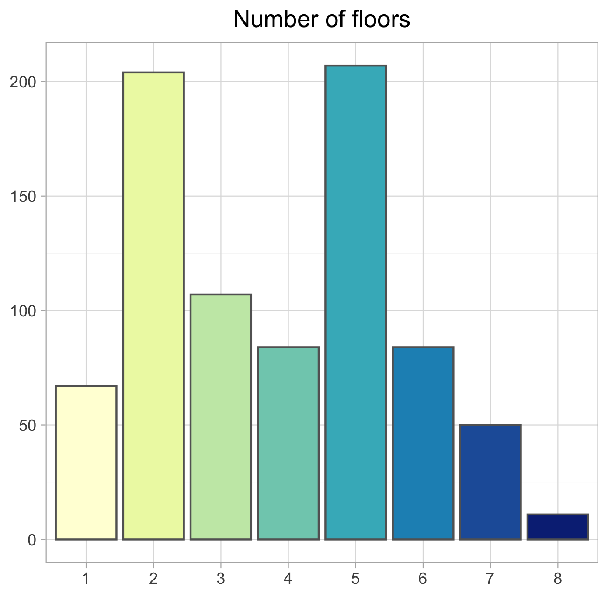
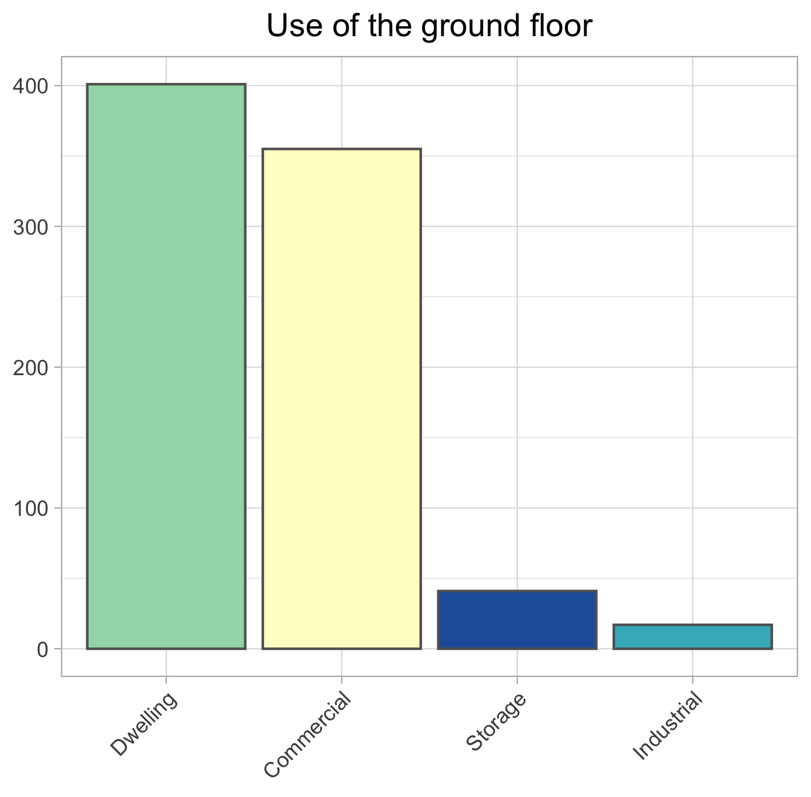
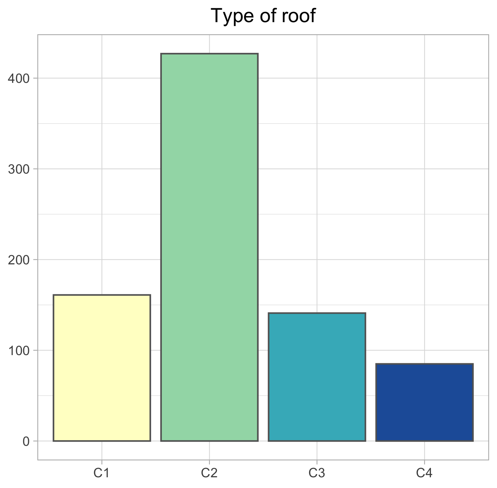
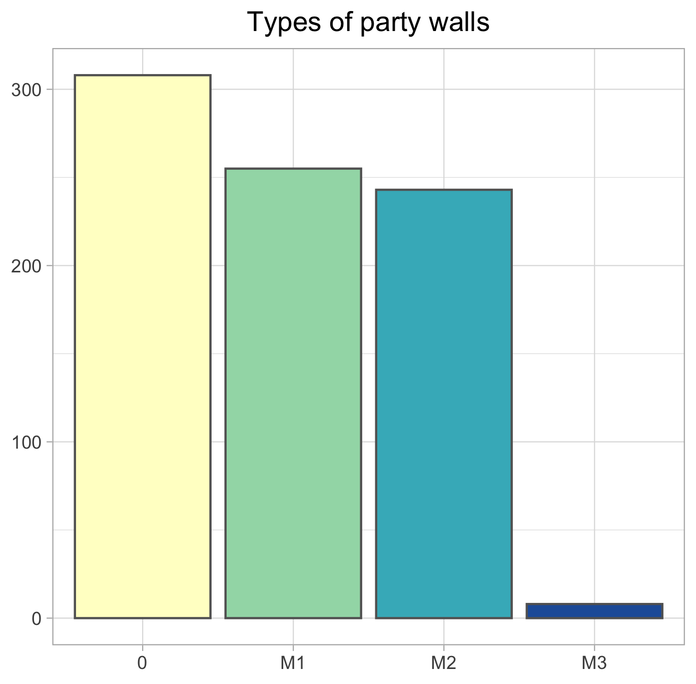
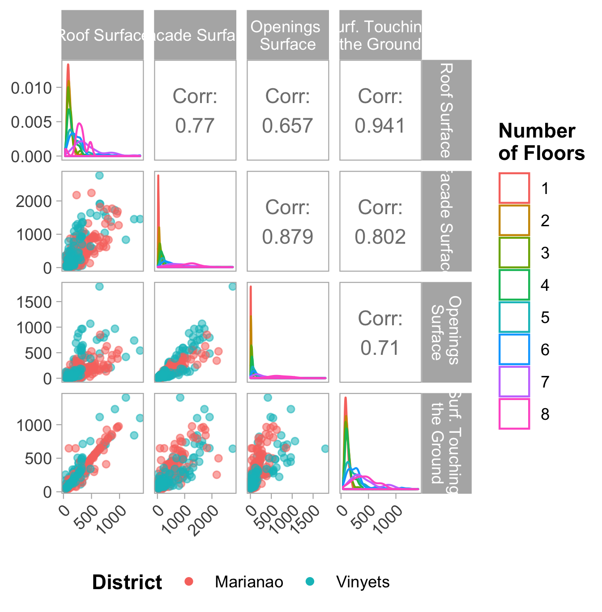
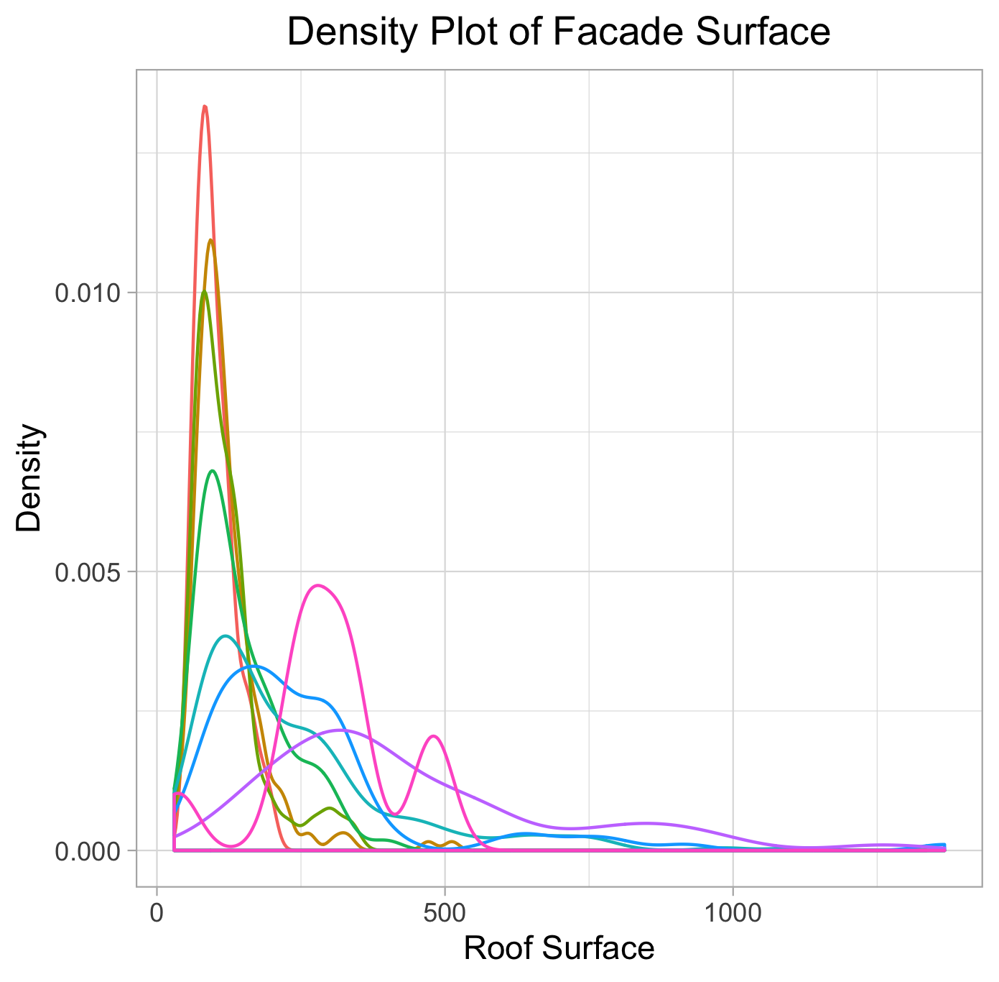

# Exploratory Data Analysis

## Table of contents

* [Introduction](#introduction)
   * [A little bit of Spanish Construction Sector History](#a-little-bit-of-spanish-construction-sector-history)
   * [Final Energy Consumption by sector in Spain](#final-energy-consumption-by-sector-in-spain)
* [Case of Study](#case-of-study)
   * [Sant Boi de Llobregat](#sant-boi-de-llobregat)
   * [Overall aim of the Study](#overall-aim-of-the-study)
* [Exploratory Data Analysis (EDA) - Discrete Variables](#exploratory-data-analysis-eda---discrete-variables)
   * [District](#district)
   * [Decade](#decade)
   * [Orientation of Buildings](#orientation-of-buildings)
   * [Number of dwellings](#number-of-dwellings)
   * [Number of floors](#number-of-floors)
   * [Use of the ground floor](#use-of-the-ground-floor)
   * [Type of facade](#type-of-facade)
   * [Types of Roofs](#types-of-roofs)
   * [Types of facade openings](#types-of-facade-openings)
   * [Types of party walls](#types-of-party-walls)
* [Exploratory Data Analysis (EDA) - Continuous Variables](#exploratory-data-analysis-eda---continuous-variables)

## Introduction

### A little bit of Spanish Construction Sector History

There are several moments of history in which an explosion of the construction sector occurs. Those are mainly between the beginning of 60's, with a massive migration from the countryside to the city; and at the beginning of the 90's until the year 2008, when the big international financial crisis begun.

  

### Final Energy Consumption by sector in Spain

The following data has been taken from IDAE [\[1\]](http://guiaenergia.idae.es/el-consumo-energia-en-espana/)

| Sector                                 | %             |
| :------------------------------------- |--------------:|
| Transportation                         | 41,7          |
| Industry                               | 23,5          |
| Households                             | 18,5          |
| Services                               | 12,5          |
| Agriculture, phishing and others       | 3,8           |

As it can be seen above, households are directly responsible of an 18,5% of the final energy consumption. An if we take into account that Services includes commerce, hostelry, offices, health and education, we can come to realize how much energy the building sector consumes.

The Standard requiring builders to use isolation on the walls of buildings came into force in the year 1980 [\[2\]](https://www.boe.es/buscar/doc.php?id=BOE-A-1979-24866). Until then, thermal isolation on the facade wasn't common.

This milestone represents a great opportunity today to address one of the main sectors when it comes to Carbon Dioxide emissions.

## Case of Study

### Sant Boi de Llobregat

The City Council of Sant Boi de Llobregat (Catalonia) asked to the Universitat Politècnica de Catalunya for a study on the Energy Efficiency of buildings in certain districts of this town.

Buildings taken into account for the study are those which were built before 1980, according to the reasons given in the previous introduction.

Data were collected from more than 800 buildings. An exploratory analysis of the variables collected on the buildings is presented here.

### Overall aim of the Study

This study have been conducted in order to establish a strategy to intervene in buildings from an energy point of view.

The two possible ways to address this problem are the following:

* Intervene those buildings which may lead to a greater amount of energy savings.
* Intervene buildings in order to reduce the chances of inhabitants to fall into energy poverty

These are items to be taken into account to make a good EDA.

## Exploratory Data Analysis (EDA) - Discrete Variables

### District

The study is oriented to the districts of [Marianao](https://www.google.es/maps/place/Marianao/@41.3479877,2.0263476,1045m/data=!3m1!1e3!4m5!3m4!1s0x12a49b822306e79d:0x3297c05bdd8c8ad1!8m2!3d41.3487888!4d2.0287207) and [Vinyets](https://www.google.es/maps/@41.3374306,2.0438772,919m/data=!3m1!1e3), according to the conditions established by the municipality.

  

MARIANAO| VINYETS
---- | ----
499 | 315

### Decade

  

Before 1899| From 1900 to 1940| From 1941 to 1960| From 1961 to 1970| From 1971 to 1980
---|---|---|---|---
19| 132| 90| 312 | 261

It seems that this city suffered a vast growth during periods of strong internal migration in the interior of the country. Notice that in the second bar in the chart there are four decades aggregated.

### Orientation of Buildings

Orientation is one of the most important factors when it comes to energy efficiency of households.

  

N| S|   E|   W| SE |NE| NW| SW
---|---|---|---|---|---|---|---
134| 131| 109| 106| 98| 86| 79| 71

The most frequent orientations are the four main cardinal points.

Regarding Bioclimatic Architectonic criteria, each orientation has its own pros and cons for this latitude (41º) and the temperate Mediterranean climate:

* SE, S and SW are preferred. Those can help to use less heating in winter by taking the direct sun radiation during practically all day in winter. This radiation can be avoided in summer easily with horizontal sun protections.
* N, NE and NW does not have the advantage of taking radiation in winter, although they give a nice indirect illumination all the year. NE and NW may produce not desirable radiation in summer during sunrise and sunset. The common strategy to solve this are vertical sun protections.
* E and W are the less desirable ones. You may have to expend a lot of air conditioning in summer.

These specificities are very relative in an urban environment with buildings located near each other and other elements as trees, that may cast shadows on buildings.

### Number of dwellings

  

Detached |From 2 to 4 dwellings| From 5 to 9 dwellings| From 10 to 19 dwellings| From 20 to 39 dwellings| More than 40 dwellings
---|---|---|---|---|---
261|182| 111|155|82|22

This variable should be taken into account in terms of how many people is going to be affected by a refurbishment oriented to building energy efficiency.

From another point of view, it would determine the ratio "money invested" over "people affected" of the operation. This may take single family households out of the scope of the strategy.

### Number of floors

  

1 floor|   2 floors|   3 floors|  4 floors|   5 floors|  6 floors|  7 floors|  8 floors
---|---|---|---|---|---|---|---
 67| 204| 107| 84| 207| 84| 50| 11

This variable is, again, one of the most important ones regarding to the investment that will be made in buildings energy efficiency.

It will be clear that single-storey buildings are candidates to stay out of the building renovation strategy.

Although it is a numerical variable, it will be considered as a categorical one, due to its ability to distinguish different types of buildings.

### Use of the ground floor

  

 Dwelling| Commercial| Storage| Industrial
 ---|---|---|---
400 | 355| 41| 17

Speaking from an energy point of view, is different to have a home than other types of usages in direct contact to your own household.

For example, in winter, when one dwelling is attached to another there won't be a heat exchange between them, as both will be commonly at the same temperature.

When the adjacent space is intended for a different use than this, it is not guaranteed that it is heated continuously, so temperature exchanges may occur.

### Type of facade

  

F1| F2|  F3
---|---|---
 468| 47| 299

Essentially this nomenclature correspond to specific and commmon construction systems in the context of the study.

* F1: Single sheet of brick, thickness of approximately 30 cm.
* F2: Single sheet of brick, thickness of approximately 15 cm.
* F3: Facade walls with air chamber of 15/10/5 cm

  

Each has its associated transmittance value. This physical property affects to the ability of the material system to keep heat or cold inside the home. This is the intuition under the following variables which classify other physical elements of buildings.

### Types of Roof

  

C1|  C2|  C3|  C4|
---| ---| ---| ---|
161| 427| 141|  85|

Once again, this variable deals with the transmittance in different cases:

* C1: Ventilated flat roof
* C2: Non-ventilated flat roof
* C3: Ventilated sloping roof
* C4: Non-ventilated sloping roof

### Types of facade opening

  

H1|  H2|  H3|  H4|  H5|
---| ---| ---| ---| ---|
 26|  28| 471| 284|   5|

In this case the different categories are mainly determined by whether or not they have been renewed and whether they have solar protections. Only windows are considered for the aim of this study.

* H1: Windows with no sign of alteration and without solar protections.
* H2: Renovated windows, without solar protections
* H3: Windows with no sign of alteration, with solar protections
* H4: Renovated windows, with solar protections
* H5: Opaque enclosures: entrance doors, garage doors,...

### Types of party wall

  

0|  M1|  M2|  M3|
---| ---| ---| ---|
308| 255| 243|   8|

Repeatedly here we describe the transmittance of the party wall with several categories. Those which are protected have an air chamber that decreases the amount of energy transferred to the exterior. This occurs when a specific construction system was founded.

* M1: Unprotected party wall
* M2: Protected party wall
* M3: Others

## Exploratory Data Analysis (EDA) - Continuous Variables

The variables represented in the next multivariate plot (credits for [Barret Schloerke](https://github.com/ggobi/ggally/issues/139#issuecomment-176271618) and [user20650](https://stackoverflow.com/a/34517880/11597692)) are the following:

* Roof Surface
* Facade Surface
* Openings Surface
* Surface Touching the Ground

  

Strong correlations appear between these physical characteristics of buildings.

When we distinguish buildings by district there are not clear differences, except that buildings in Marianao may be slightly larger.

As we can see, buildings with similar number of heights present similar physical characteristics.

  

All the information gathered here was taken into account in order to reach the aim of the study developed for the Sant Boi de Llobregat City Council.
