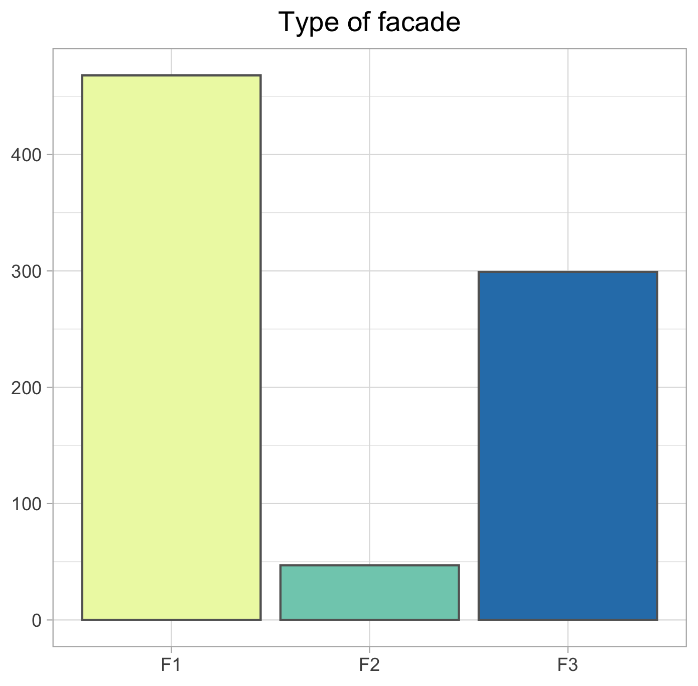
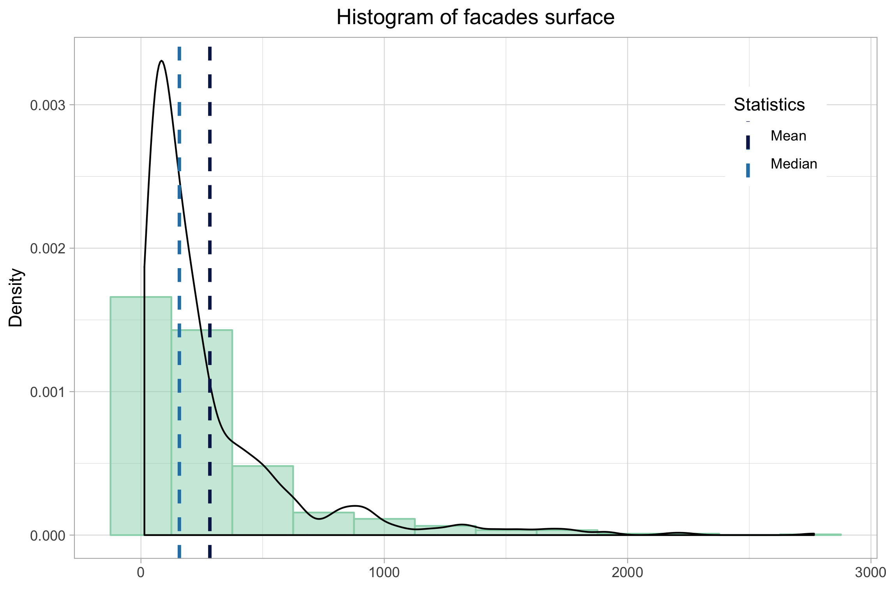
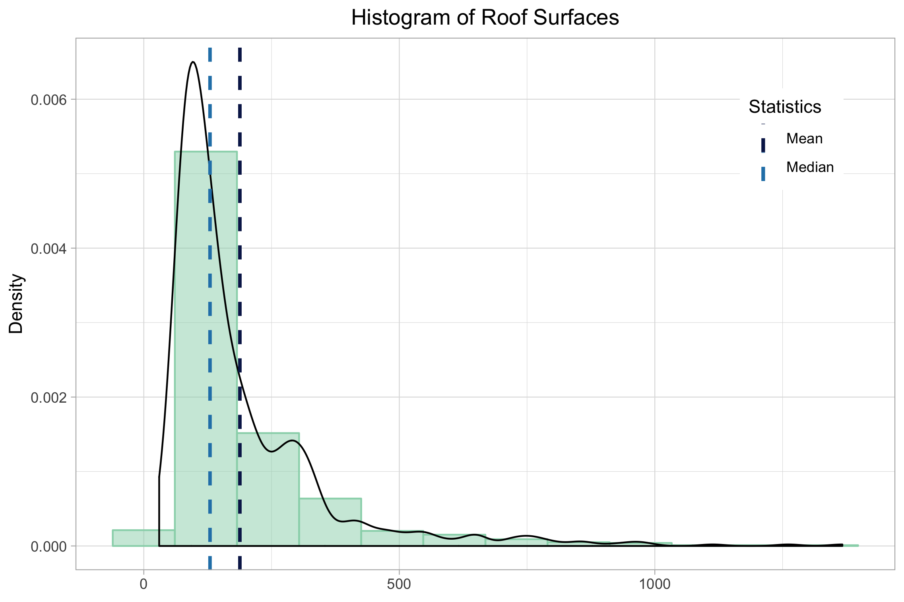
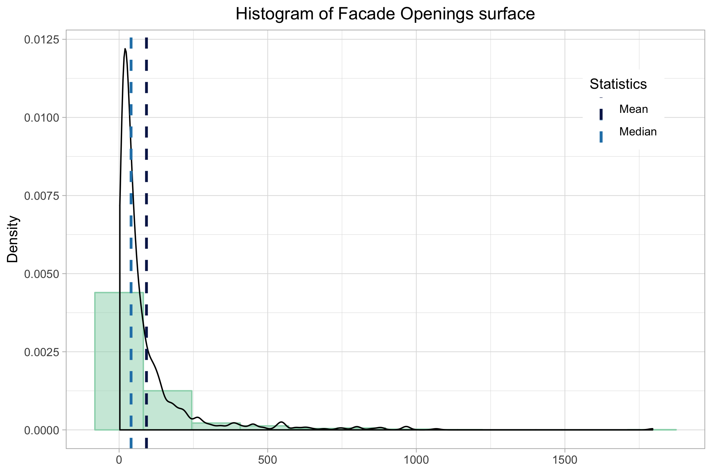
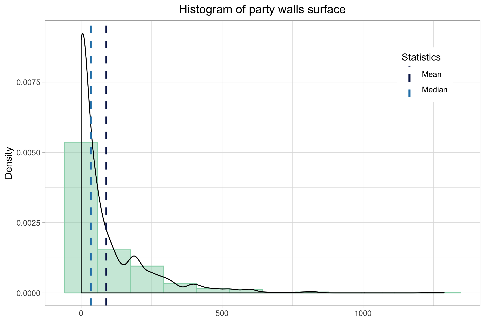
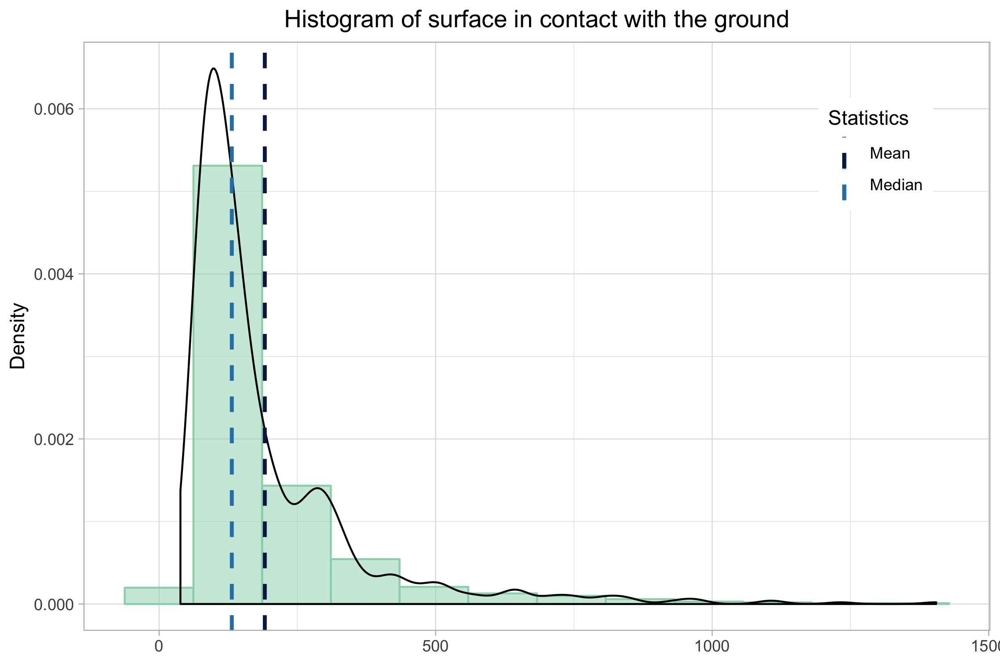
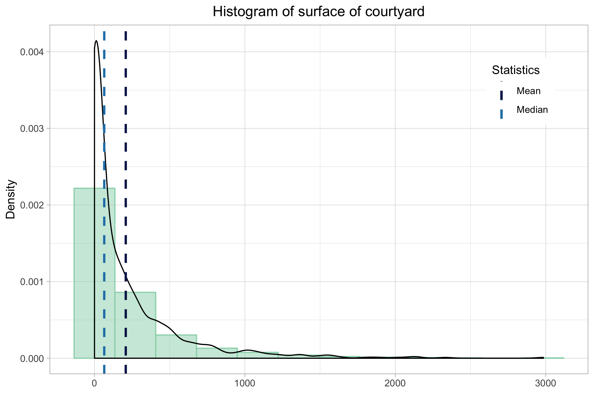

# Sant Boi

## Case of Study

### A little bit of Spanish Construction Sector History

There are several moments of history in which an explosion of the construction sector occurs. Those are mainly between the beginning of 60's, with a massive migration from the countryside to the city; and at the beginning of the 90's until the year 2008, when the big international financial crisis begun.

  

### Final Energy Consumption by sector in Spain

The following data has been taken from IDAE [\[1\]](http://guiaenergia.idae.es/el-consumo-energia-en-espana/)

| Sector                                 | %             |
| :------------------------------------- |--------------:|
| Transportation                         | 41,7          |
| Industry                               | 23,5          |
| Households                             | 18,5          |
| Services                               | 12,5          |
| Agriculture, phishing and others       | 3,8           |

As it can be seen above, households are directly responsible of an 18,5% of the final energy consumption. An if we take into account that Services includes commerce, hostelry, offices, health and education, we can come to realize how much energy the building sector consumes.

The Standard requiring builders to use isolation on the walls of buildings came into force in the year 1980 [\[2\]](https://www.boe.es/buscar/doc.php?id=BOE-A-1979-24866). Until then, thermal isolation on the facade wasn't common.

This milestone represents a great opportunity today to address one of the main sectors when it comes to Carbon Dioxide emissions.

### Sant Boi de Llobregat

The City Hall of Sant Boi de Llobregat (Catalonia) asked to the Universitat Politècnica de Catalunya for a study on the Energy Efficiency of buildings in certain districts of the town.

Buildings taken into account for the study are those which were built before 1980, according to the reasons given in the previous introduction.

Data were collected from more than 800 buildings. An exploratory analysis of the variables collected on the buildings is presented here.

## Exploratory Data Analysis - Univariate Analysis

### District

The study is oriented to the districts of Marianao and Vinyets, according to the conditions established by the municipality.

  

MARIANAO| VINYETS
---- | ----
499 | 315

### Decade

  

Before 1899| From 1900 to 1940| From 1941 to 1960| From 1961 to 1970| From 1971 to 1980
---|---|---|---|---
19| 132| 90| 312 | 261

It seems that this city suffered a vast growth during periods of strong internal migration in the interior of the country. Notice that in the second bar in the chart there are four decades aggregated.

### Orientation of Buildings

  

N| S|   E|   W| SE |NE| NW| SW
---|---|---|---|---|---|---|---
134| 131| 109| 106| 98| 86| 79| 71

The most frequent orientations are the four main cardinal points. In terms of Bioclimatic Architectonic criteria, the best ones in this case are SE, SW and S

### Number of dwellings

  

Detached |From 2 to 4 dwellings| From 5 to 9 dwellings| From 10 to 19 dwellings| From 20 to 39 dwellings| More than 40 dwellings
---|---|---|---|---|---
261|182| 111|155|82|22

### Number of floors

  

1|   2|   3|  4|   5|  6|  7|  8
---|---|---|---|---|---|---|---
 67| 204| 107| 84| 207| 84| 50| 11

 Min.| 1st Qu.| Median|   Mean| 3rd Qu.| Max.|
   ---|     ---|    ---|    ---|     ---|  ---|
     1|       2|      4|   3.82|       5|    8|

### Use of the ground floor

  

 Dwelling| Commercial| Storage| Industrial
 ---|---|---|---
400 | 355| 41| 17

### Facade
#### Type of façade

  

F1| F2|  F3
---|---|---
 468| 47| 299

#### Facade surface

  

Min.| 1st Qu.| Median|  Mean| 3rd Qu.|    Max.|
---|  ---| ---| ---|  ---|  ---|
 14|   77| 158| 283|  344| 2766|

### Roof
#### Types of Roofs

  

C1|  C2|  C3|  C4|
---| ---| ---| ---|
161| 427| 141|  85|

#### Roofs surface

  

Min.| 1st Qu.| Median|   Mean| 3rd Qu.| Max.|
---|  ---| ---| ---|  ---|  ---|
 30|   91| 130| 188|  225| 1367|

### Facade openings
#### Types of facade openings

  

H1|  H2|  H3|  H4|  H5|
---| ---| ---| ---| ---|
 26|  28| 471| 284|   5|

#### Openings surface

  

Min.| 1st Qu.| Median| Mean| 3rd Qu.| Max.|
  ---|     ---|    ---|  ---|     ---|  ---|
    3|      19|     40|   92|      94| 1795|

### Party walls
#### Types of party walls

  

0|  M1|  M2|  M3|
---| ---| ---| ---|
308| 255| 243|   8|

#### Party walls surface

  

Min.| 1st Qu.| Median| Mean| 3rd Qu.| Max.|
  ---|     ---|    ---|  ---|     ---|  ---|
    0|       0|     34|   89|     118| 1287|

### Surface in contact with the ground

  

Min.| 1st Qu.| Median| Mean| 3rd Qu.| Max.|
  ---|     ---|    ---|  ---|     ---|  ---|
   39|      94|    132|  191|     226| 1405|

### Surface of courtyard

  

Min.| 1st Qu.| Median| Mean| 3rd Qu.| Max.|
  ---|     ---|    ---|  ---|     ---|  ---|
    0|       0|     65|  208|     269| 2985|
